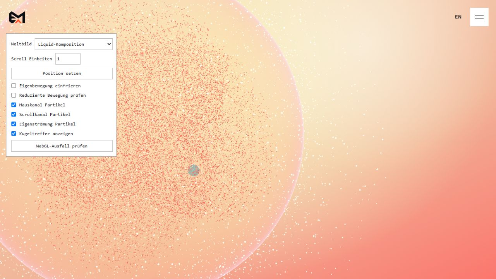

# K4.1 — Kugellokale Eingabe

Stand: 01.10.2026. Implementiert und lokal geprüft, keine visuelle Abnahme der Partikelwirkung. Als `f9d5459` committed und mit `0ee100b` auf `main` gepusht. Die folgenden Ergebnisse dokumentieren die K4.1-Basis ohne sichtbares Feld; der spätere Feldstand ist separat in [K4.2](k4-2-verification.md) dokumentiert.

## Umsetzung

- `lib/particle-interaction.ts`: reine numerische Projektion und Eingabeabtastung, ohne React oder Laufzeitimport von Three.js. NDC-Strahl durch aktuelle inverse Kameraprojektion, Kameraweltmatrix und inverse Gruppenweltmatrix.
- Analytischer vorderer Hüllentreffer bei Radius 1,45. Nahe Fehltreffer erhalten einen kontinuierlichen Einfluss im Halo bis 2,16; darüber Einfluss null. Am Kugelrand kein Sprung auf die Vorderfläche einer zweiten größeren Kugel.
- Vorherige und aktuelle Bildschirmposition werden mit **derselben aktuellen Pose** projiziert. Dadurch wird eine bewegte Kugel bei ruhender Maus nicht als Mausbewegung interpretiert. Lokale Mausgeschwindigkeit ist auf 12 Einheiten/s begrenzt; Scroll bleibt ein eigener vorzeichenbehafteter Kanal, maximal 30 kanonische Einheiten/s.
- Wiedereintritt, deaktivierter Kanal, lange Pause, Freeze, Reduced Motion und Resize verhindern alte Bewegungsspitzen. Touch, Menü und Interaktionen in der Diagnose setzen den Zeiger inaktiv.
- Bestehende lokale Diagnose `?renderDebug=1`: Maus, Scroll und Eigenströmung separat schaltbar; optionaler türkiser Treffermarker. `data-particle-interaction` enthält Treffer, Einfluss, Geschwindigkeit und Rückprojektion. Diagnose wird nur auf localhost aktiviert, Schalter werden außerhalb der Diagnose auf normale Werte zurückgesetzt.
- Numerischer Zustand bleibt außerhalb React. Aktuelle Matrizen werden nach der Gruppenpose aktualisiert. Bestehender zentraler Frame-Takt, Eingabelistener, dynamischer Three-Import und Ressourcen-Scope bleiben erhalten.

## Prüfungen

| Prüfung | Ergebnis |
|---|---|
| `npm test` | 33/33 bestanden; acht neue Tests |
| `npx tsc --noEmit` | Bestanden |
| `npm run lint` | Bestanden |
| `npm run build:pages` | Bestanden; zehn statische Seiten erzeugt |
| Analytische Projektion | Gegen Three.js-Ray/Sphere geprüft: Translation, Rotation, nichtuniforme Skalierung, verschiedene perspektivische und orthografische Kameras |
| Halo/Rand | Kontinuierliche Position am Tangentenrand, Einfluss 0–1, weicher Auslauf; ungültige Matrizen und Strahlen ergeben keinen Treffer |
| Eingabetrennung | Ruhende Bildschirmmaus trotz Kamera-/Gruppenbewegung: Geschwindigkeit null; tatsächliche Bewegung unter aktueller Pose und getrennte Scrollvorzeichen geprüft |
| Wiedereintritt/Resize/Pause | Kein gespeicherter Eingangsschub; nächste tatsächliche Bewegung wieder wirksam; Freeze/Reduced Motion sperren Kräfte |
| DPR | Identische CSS/NDC-Zuordnung bei DPR 1, 1,35, 2 und 3 numerisch geprüft |

## Tatsächliche Browserprüfung

Interner Codex-Browser, lokaler Devserver, Desktop **1281 × 721**, mobiler Resize **391 × 844**. Keine Konsolenfehler oder Shaderfehler in der Prüfsitzung.

- Desktop bei Scroll-Einheit 1: Zeiger `(500, 440)` trifft die Hülle. NDC `(-0,2191964; -0,2207487)`; Rückprojektion stimmt bis zur numerischen Rundung überein. Lokaler Punkt etwa `(0,00849; -0,25717; 1,42699)`.
- Scrollen mit derselben Zeigerposition von 1 auf 1,5: Treffer wechselt in den Halo, lokaler Punkt etwa `(0,86071; -1,03218; 0,63668)`, Einfluss etwa 0,99208. Mausgeschwindigkeit bleibt `(0, 0, 0)`, obwohl die Kugelpose sich geändert hat. Die 500-ms-Diagnose ist eine Stichprobe; die Impulstrennung jedes Frames wird zusätzlich numerisch getestet.
- Maus und Eigenströmung abgeschaltet: Treffer/Einfluss null, `flowEnabled: false`, Scrollkanal bleibt separat aktiv.
- Mobil bei Scroll-Einheit 0: Zeiger `(180, 650)` trifft die Hülle nach Resize. NDC `(-0,0783958; -0,5396126)` stimmt mit Rückprojektion überein; keine Geschwindigkeitsspitze.
- Zusätzliche Resize-Nachprüfung von 703 × 798 auf 391 × 844 ohne neues Zeigerereignis: bisherige NDC-Eingabe wird im bestehenden zentralen Frame inaktiv gesetzt. Neue reale Zeigereingabe aktiviert den Treffer wieder. Größenvergleich verwendet dieselben ganzzahligen CSS-Maße; die eigentliche NDC-Umrechnung behält die exakten Bounding-Rect-Maße.
- Reduced Motion: Einfluss, Mausgeschwindigkeit und Scrollgeschwindigkeit null, Eigenströmung deaktiviert. Freeze: keine Eingabekräfte; Zeit wird im gemeinsamen Frame eingefroren, bestehende eingefrorene Form bleibt erhalten.
- Normale Ansicht ohne Diagnoseparameter: kein Diagnosepanel, keine Partikeldiagnose im DOM. Texte, Links, Sprachwechsel und Scrollstrecke unverändert.

Eigener Desktop-Beleg mit **lokalem Diagnosemarker**, kein neues Gestaltungselement der Website:

## Grenzen und nächster Schritt

- Dies ist die Eingabebasis, **noch keine sichtbare lokale Partikelströmung**. Das neue lokale Feld, Impulsspeicher, Nachlauf und Rückkehr zur Grundverteilung gehören zu K4.2. Der Flow-Schalter isoliert bislang die vorhandene kleine Sinus-Eigenbewegung.
- Projektion bezieht sich auf das geometrische Weltbild **vor dem Liquid-Kompositionspass**. Der Marker wird wie die Kugel anschließend mitverzerrt. Exakte Zeigerzuordnung auf optisch gebrochene Bildpunkte im aktiven Liquid-Band ist damit nicht zugesagt und bei der gemeinsamen K4-/G1-Prüfung gesondert zu bewerten.
- Numerische DPR-Prüfung und mobiler Desktop-Viewport ersetzen keine echte iOS-/Android-Touchprüfung. Die vollständige Lebenszyklus-/Kontextverlustprüfung für künftige Feldzustände bleibt K4.5.
- Zusätzliche Referenzkräfte und exaktes Nachlauftiming aus K4.0 sind weiterhin nicht quantitativ freigegeben. Weder diese Eingabebasis noch bestandene Tests belegen optische Gleichwertigkeit.
